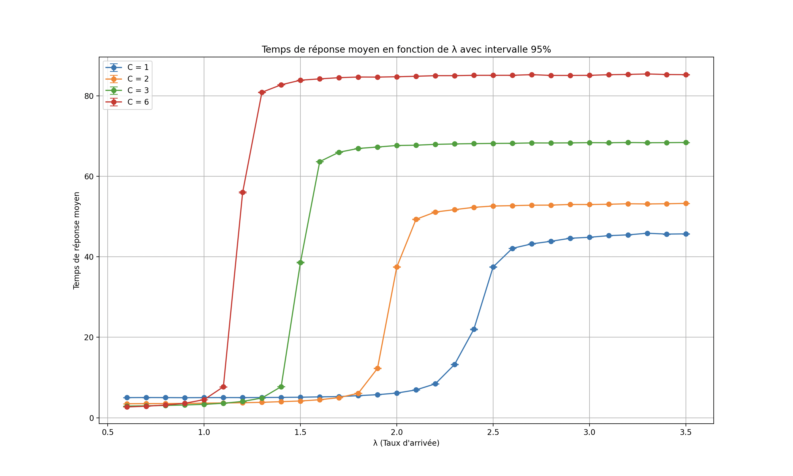
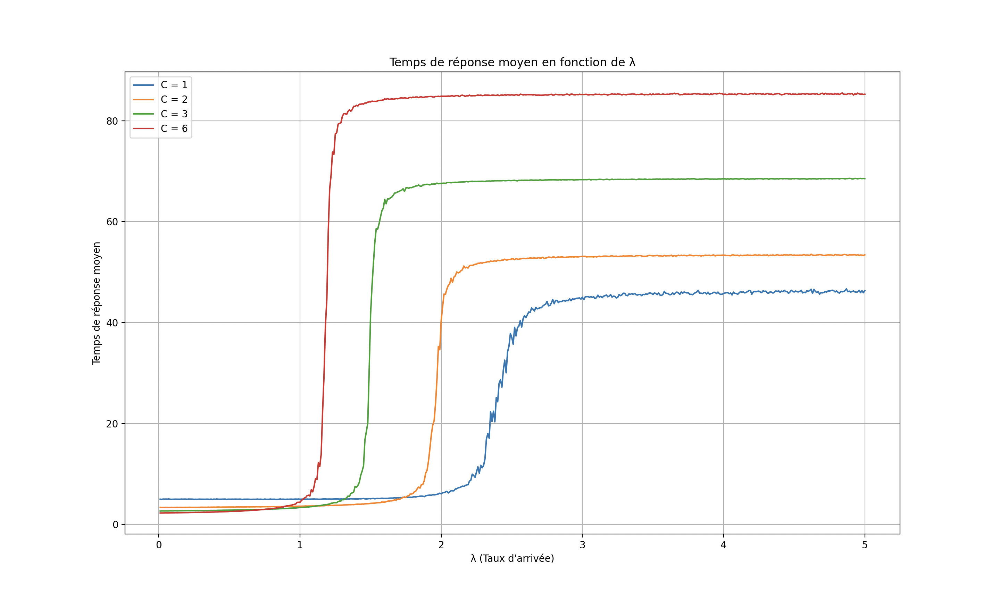
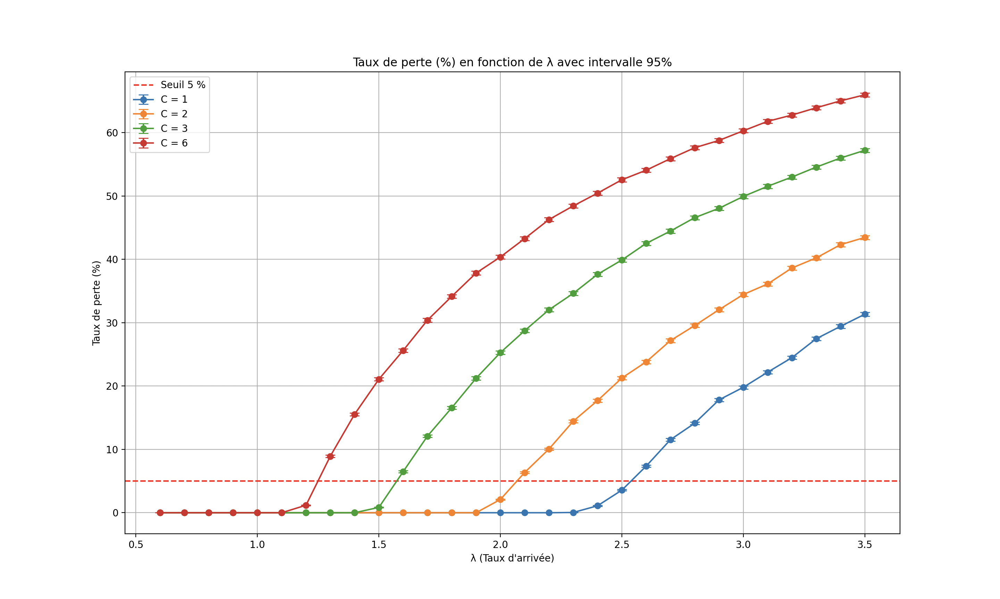
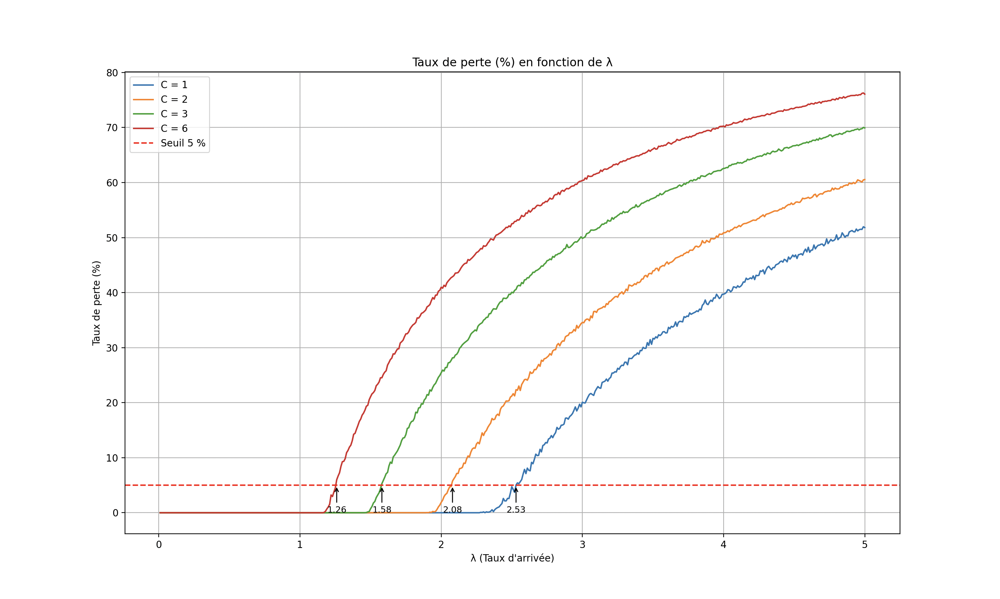

# Compte-rendu du projet de simulation: ferme de serveurs

Ce compte-rendu présente l’étude d’un système de répartition de requêtes dans une ferme de serveurs à l’aide d’une simulation. L’objectif est de déterminer, pour différentes charges de travail (modélisées par le taux d’arrivée λ), la configuration optimale du système, représentée par le paramètre C, qui correspond au nombre de types de serveurs spécialisés. L’analyse repose principalement sur deux indicateurs de performance : le temps de réponse moyen et le taux de perte des requêtes, complétés par le calcul d’intervalles de confiance à 95 %. Différents graphiques permettent de visualiser les comportements du système selon les valeurs de λ et d’identifier les meilleures configurations possibles.

## Graphiques du temps de réponse moyen pour chaque valeur de C quand le paramètre λ varie

### 1. Graphique avec un nombre réduit de valeurs de λ, incluant les intervalles de confiance à 95 % :

> Ce graphique présente l’évolution du temps de réponse moyen en fonction du taux d’arrivée λ, pour différentes valeurs de C. Chaque courbe correspond à une valeur distincte de C, et chaque point est accompagné de son intervalle de confiance à 95 %.

### 2. Graphique plus détaillé avec un plus grand nombre de valeurs de λ testées, sans affichage des intervalles de confiance :

> Ce graphique montre l’évolution du temps de réponse moyen en fonction du taux d’arrivée λ, pour différentes valeurs de C. Chaque courbe est tracée à partir d’une multitude de points simulés, ce qui permet d’observer plus finement la variation du temps de réponse sans afficher les intervalles de confiance ni les points individuels.

## Graphiques taux de perte des requêtes pour chaque valeur de C quand le paramètre λ varie

### 1. Graphique avec un nombre réduit de valeurs de λ, mais incluant les intervalles de confiance à 95 % :

> Ce graphique présente le taux de perte des requêtes en fonction du taux d’arrivée λ, pour différentes valeurs de C. Un nombre réduit de valeurs de λ a été sélectionné, mais les intervalles de confiance à 95 % sont affichés pour chaque point. La ligne pointillée horizontale représente le seuil critique de 5 %, au-delà duquel les performances sont considérées comme dégradées.

### 2. Graphique plus précis incluant davantage de valeurs de λ, en particulier celles pour lesquelles le taux de perte dépasse 5 % :

> Ce graphique présente le taux de perte des requêtes en fonction du taux d’arrivée λ, pour différentes valeurs de C. Chaque courbe est tracée à partir d’une multitude de points simulés, ce qui permet d’observer plus finement la variation du taux de perte sans afficher les intervalles de confiance ni les points individuels.. Des flèches indiquent les valeurs de λ pour lesquelles le taux de perte dépasse le seuil critique de 5 % pour chaque valeur de C.

## Choix optimal de C dans le cas où λ = 1

Pour déterminer la valeur optimale du paramètre C lorsque λ = 1, nous avons commencé par simuler les performances du système pour les quatre valeurs différentes du paramètre C, avec λ fixé à 1. À partir des résultats obtenus, nous avons sélectionné la valeur du paramètre C correspondant au temps de réponse moyen le plus court. Ensuite, nous avons comparé les intervalles de confiance à 95 % des différentes valeurs du paramètre C. Si l’intervalle d’un autre paramètre C chevauchait celui du meilleur paramètre C, cela aurait signifié que les performances des deux configurations étaient statistiquement similaires, et qu’il aurait fallu considérer d’autres critères pour les départager.

Voici les résultats que nous avons obtenu pour λ = 1 :

|C| Temps de réponse moyen| IC 95%| Taux de perte| Évaluation|
|-|-|-|-|-|
|1| 5.04 | [5.004458, 5.066874]| 0.00%| ❌ Rejeté |
|2| 3.61 | [3.592496, 3.628178] | 0.00%| ❌ Rejeté|
|3| 3.34 | [3.326397, 3.353339] | 0.00%  | ✅ Optimal|
|6|4.53| [4.516264, 4.552064]| 0.00%| ❌ Rejeté|

Pour λ = 1, le paramètre C avec le meilleurs temps de réponse est donc égale à 3.

## Choix optimal pour le paramètre C pour diérentes valeurs de λ

On applique la même méthodologie que pour λ = 1, cette fois pour différentes valeurs de λ. En plus du temps de réponse moyen, on élimine toute valeur de C pour laquelle le taux de perte dépasse 5 %. Si aucune valeur de C ne respecte ce seuil (c’est-à-dire que toutes ont un taux de perte supérieur à 5 %), on choisit celle qui minimise le taux de perte.

Voici les résultats obtenus pour différentes valeurs de λ :

|λ                   | Meilleur(s) C       | IC 95%                                            | Taux de perte       |
|--------------------|---------------------|---------------------------------------------------|---------------------|
|0.1                 | 6                   | [2.285, 2.303]                                    | 0.00%               |
|0.2                 | 6                   | [2.330, 2.348]                                    | 0.00%               |
|0.3                 | 6                   | [2.392, 2.411]                                    | 0.00%               |
|0.4                 | 6                   | [2.469, 2.488]                                    | 0.00%               |
|0.5                 | 6                   | [2.559, 2.577]                                    | 0.00%               |
|0.6                 | 6                   | [2.680, 2.700]                                    | 0.00%               |
|0.7                 | 6                   | [2.865, 2.886]                                    | 0.00%               |
|0.8                 | 3                   | [3.032, 3.058]                                    | 0.00%               |
|0.9                 | 3                   | [3.141, 3.168]                                    | 0.00%               |
|1.0                 | 3                   | [3.336, 3.363]                                    | 0.00%               |
|1.1                 | 3                   | [3.590, 3.619]                                    | 0.00%               |
|1.2                 | 2                   | [3.736, 3.772]                                    | 0.00%               |
|1.3                 | 2                   | [3.824, 3.861]                                    | 0.00%               |
|1.4                 | 2                   | [3.970, 4.007]                                    | 0.00%               |
|1.5                 | 2                   | [4.127, 4.165]                                    | 0.00%               |
|1.6                 | 2                   | [4.437, 4.476]                                    | 0.00%               |
|1.7                 | 2                   | [4.992, 5.035]                                    | 0.00%               |
|1.8                 | 1                   | [5.411, 5.474]                                    | 0.00%               |
|1.9                 | 1                   | [5.710, 5.775]                                    | 0.00%               |
|2.0                 | 1                   | [5.978, 6.044]                                    | 0.00%               |
|2.1                 | 1                   | [7.047, 7.122]                                    | 0.00%               |
|2.2                 | 1                   | [8.870, 8.960]                                    | 0.00%               |
|2.3                 | 1                   | [11.550, 11.657]                                  | 0.00%               |
|2.4                 | 1                   | [29.128, 29.295]                                  | 1.31%               |
|2.5                 | 1                   | [37.506, 37.646]                                  | 4.44%               |
|2.6                 | 1                   | [41.213, 41.326]                                  | 7.73%               |
|2.7                 | 1                   | [43.378, 43.478]                                  | 11.36%              |
|2.8                 | 1                   | [43.796, 43.892]                                  | 14.03%              |
|2.9                 | 1                   | [44.502, 44.600]                                  | 17.21%              |
|3.0                 | 1                   | [44.533, 44.635]                                  | 19.66%              |
  
On observe ainsi que :
- pour les valeurs de λ comprises entre 0.1 et 0.7, le paramètre C optimal est 6
- pour λ entre 0.8 et 1.1, le paramètre optimal devient C = 3
- entre 1.2 et 1.7, c’est C = 2 qui est le plus adapté
- enfin, pour λ supérieur ou égal à 1.8, la meilleure configuration correspond à C = 1

Il existe également des cas particuliers où plusieurs valeurs du paramètre C donnent des résultats équivalents. Dans ces situations, un autre critère est nécessaire pour les départager.

Comme par exemple λ = 1.14 :

|C    | TRM moyen   | IC 95%                   | Taux de perte  | Évaluation           |
|-----|-------------|--------------------------|----------------|----------------------|
|1    | 5.00        | [4.964783, 5.026550]     | 0.00%          | ❌ Rejeté            |
|2    | 3.69        | [3.669343, 3.705043]     | 0.00%          | 🔶 Comparable        |
|3    | 3.70        | [3.686308, 3.715518]     | 0.00%          | 🔶 Comparable        |
|6    | 12.84       | [12.767402, 12.905417]   | 0.00%          | ❌ Rejeté            |

Dans ces cas-là, on peut estimer que la meilleure valeur pour le paramètre C est celle qui correspond à la structure la plus simple à mettre en œuvre. Par exemple, on pourrait préférer C = 2, car spécialiser deux types de serveurs peut être moins coûteux ou plus facile à gérer que d’en spécialiser trois. Toutefois, un autre critère aurait aussi pu être choisi pour les départager.

## Conclusion

L’étude a permis d’identifier l’évolution du paramètre optimal C en fonction du taux d’arrivée λ. On observe une transition progressive du paramètre optimal allant de C = 6 pour les faibles charges (λ ≤ 0.7) à C = 1 pour les charges très élevées (λ ≥ 1.8). Cette tendance reflète l’adaptation nécessaire du système à la charge pour maintenir de bonnes performances. Dans certains cas, plusieurs valeurs de C donnent des résultats équivalents : des critères secondaires comme la simplicité de mise en œuvre peuvent alors être utilisés pour départager les configurations. Ce travail illustre l’intérêt de la simulation pour guider des décisions d’architecture système en tenant compte à la fois de la performance et de la robustesse.